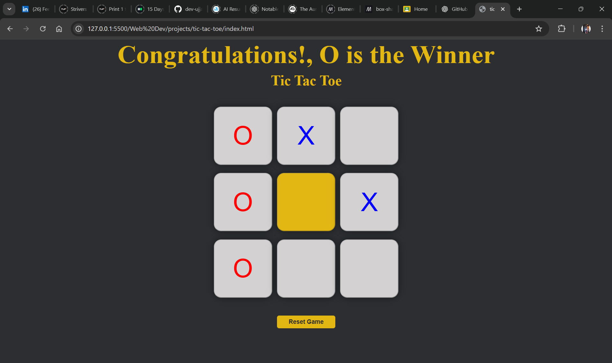
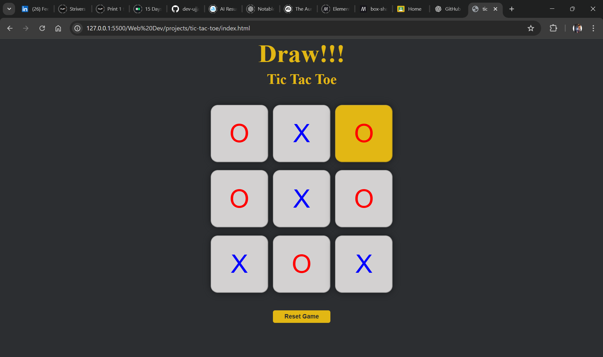

# Tic Tac Toe Game 🎮

A simple and interactive Tic Tac Toe game built using HTML, CSS, and JavaScript.  
This project implements complete game logic including win detection, draw detection, and game reset functionality.

---

## 🔗 Live Demo
https://dev-ujjawal.github.io/tic-tac-toe-game/

## Features

- Two-player gameplay (Player X and Player O)
- Automatic win detection
- Draw detection when no winning moves are left
- Restart game functionality
- Real-time updates using DOM manipulation
- Clean and minimal user interface

---

## Game Logic

- Players take turns placing X and O on a 3×3 grid
- After every move, the game checks all possible winning combinations
- If a player satisfies a winning condition, the game ends and displays the winner
- If all cells are filled and no winning condition is met, the game is declared a draw
- The restart button resets the board and allows a new game to begin

---

## Technologies Used

- HTML
- CSS
- JavaScript

---

## Project Structure

tic-tac-toe/
├── assets/
│ ├── screenshot-1.png
│ ├── screenshot-win.png
│ └── screenshot-draw.png
├── index.html
├── style.css
├── app.js
└── README.md

---

## How to Run the Project

1. Clone the repository:
   git clone https://github.com/dev-ujjawal/tic-tac-toe-game.git

2. Open the project folder

3. Open index.html in any web browser

No additional setup is required.

---

## Game Screenshots

## Game Screenshots

### 🟢 Game Start

  

### 🏆 Winning State

  

### 🤝 Draw State

  

## Future Improvements

- Single-player mode with AI
- Score tracking
- Mobile responsiveness
- UI animations
- Sound effects

---

## License

This project is open-source and free to use for learning and practice purposes.
